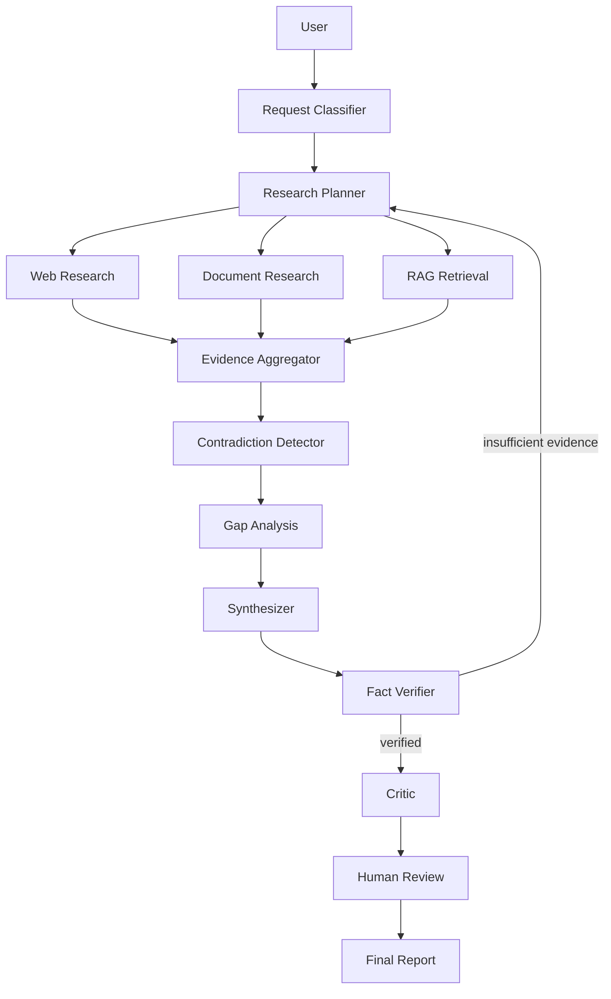

# Atlas

**Agentic Research, Knowledge Retrieval and Decision Intelligence Platform**

See [FAILURES.md](./FAILURES.md) for what can go wrong, what broke, how it was fixed, and results.

Atlas is not a chatbot and not a "chat with PDF" demo.

It is a production-style research system that turns a complex question into a plan, gathers evidence from public and private sources, scores source quality, detects contradictions, verifies citations, estimates confidence, and can pause for human approval before a recommendation is finalised.

> Analyse whether a small UK technology company should pursue a specific public-sector opportunity.

Atlas will not send that sentence straight to a model. It will classify the request, generate structured subtasks, research in parallel, retrieve uploaded documents, extract evidence, and only then write a cited report.

## Why this repository exists

This project is intended to demonstrate production AI engineering:

- LangGraph state machines, not prompt-only "agents"
- Evidence objects and citation graphs, not invented footnotes
- Hybrid RAG over pgvector
- Human-in-the-loop
- Evaluation that is not exclusively LLM-as-judge
- FastAPI, Postgres, Redis, Docker, tests, ADRs

## Architecture

```text
FastAPI / Streamlit
        │
ResearchOrchestrator
        │
  LangGraph app
        │
   ┌────┼────┐
Planner  Researchers  Verifier / Critic / Synthesiser
           │
     Web + private docs
           │
     Evidence store
           │
 PostgreSQL + pgvector + Redis
```



## Agent workflow

| Stage | Responsibility | Tools |
| --- | --- | --- |
| Classifier | Intent, sensitivity, impact | none |
| Planner | Structured `ResearchTask`s and queries | none |
| Researcher | Public sources | `web_search`, `fetch_web_page`, `calculator` |
| Document analyst | Private corpus | `search_documents`, `retrieve_document_chunks` |
| Contradiction detector | Structured conflicts | none |
| Synthesiser | Grounded report | none |
| Verifier | Citation and numeric checks; can loop | none |
| Critic | Attacks reasoning, does not rewrite | none |
| Human review | Approve / more research / cancel | none |

Agents do **not** share one mega-prompt. Tool access is least privilege.

## Technology stack

- Python 3.12, `uv`
- LangChain, LangGraph, LangSmith
- FastAPI, Pydantic, SSE
- PostgreSQL + pgvector, Redis
- SQLAlchemy 2, Alembic
- pytest, ruff, mypy
- Docker Compose
- Optional Streamlit UI

## LangGraph

The compiled graph is `src/atlas/graph/workflow.py`.

State is a typed `ResearchState` (plan, evidence, contradictions, confidence, iteration, human decision). Conversation history is not used as the system of record.

Independent tasks fan out with LangGraph `Send` and fan in to analysis.

Checkpoints make `/research/{id}/resume` possible after process restart (domain data is always in Postgres; swap the in-memory saver for `langgraph-checkpoint-postgres` for multi-replica deploys).

## RAG architecture

```text
Document → parser → metadata → chunker → embedding → pgvector
Query → rewrite → vector search + keyword search → RRF → rerank → dedup → Evidence
```

Supported ingest formats: PDF, TXT, Markdown, DOCX, HTML.

## Evidence and citations

Every important claim should point at retrieved evidence. If Atlas cannot close the chain it marks the claim **unsupported** instead of inventing a URL.

```text
Claim → Evidence → Source (URL or document_id)
```

## Source quality

Sources are classified as `PRIMARY`, `GOVERNMENT`, `ACADEMIC`, `COMPANY_SOURCE`, `ESTABLISHED_MEDIA`, `INDUSTRY`, `COMMUNITY`, or `UNKNOWN`. A random blog does not outrank an NCSC publication when both exist.

## Contradiction detection

Example from the bundled demo:

| Topic | Source A | Source B |
| --- | --- | --- |
| Annual revenue | £15m (internal briefing) | £21m (public commentary) |

Possible explanation: different reporting periods or management vs statutory figures. Resolution: unresolved.

## Human approval

The graph pauses when:

- confidence is below `ATLAS_HITL_LOW_CONFIDENCE`
- the request is high-impact
- material contradictions remain

Resume with `POST /research/{id}/resume` and `approve` | `request_more_research` | `cancel`.

## Evaluation

`uv run atlas-eval` runs deterministic checks for groundedness, citation correctness, coverage, contradiction detection and hallucination flags. LLM-as-judge is optional and not required.

## Screenshots

Run the Streamlit UI after the API is up (`apps` layout or `src/atlas/apps/ui/app.py`). The UI shows query, progress, plan, sources, evidence, contradictions, confidence and the final report.

## Installation

```bash
uv sync --extra dev
cp .env.example .env
```

Demo mode is the default (`MODEL_PROVIDER=demo`). No vendor keys are required to run tests or a local research pass.

## Docker

```bash
docker compose up --build
```

Services: API `:8000`, Streamlit `:8501`, PostgreSQL 16 + pgvector, Redis.

## Configuration

See `.env.example`. Important groups:

- `DATABASE_URL`, `REDIS_URL`
- `MODEL_PROVIDER` / `MODEL_NAME` (`openai`, `anthropic`, `google`, `ollama`, `demo`)
- Provider keys (never commit them)
- `LANGSMITH_TRACING`, `LANGSMITH_API_KEY`, `LANGSMITH_PROJECT`
- Budgets: `ATLAS_MAX_RESEARCH_TASKS`, `ATLAS_MAX_ITERATIONS`, `ATLAS_MAX_SOURCES`, `ATLAS_MAX_TOKENS`, `ATLAS_RESEARCH_BUDGET_USD`

## Example research

1. Start Postgres/Redis (Compose) or run the graph offline in demo mode.
2. Ingest `demo/documents/*`.
3. `POST /research` with:

```text
Analyse whether Acme Technology should enter the UK public-sector cybersecurity market.

Identify market opportunity, barriers, procurement requirements, major competitors,
risks and a recommended entry strategy.
```

Expected visible behaviour: plan → parallel research → retrieval → contradiction on £15m vs £21m → verification → confidence → cited recommendation (typically framework / subcontract entry, not first-time prime bidding).

## API

| Method | Path | Purpose |
| --- | --- | --- |
| POST | `/research` | Start a run |
| GET | `/research/{id}` | Snapshot |
| POST | `/research/{id}/resume` | Human decision |
| POST | `/research/{id}/cancel` | Cancel |
| GET | `/research/{id}/evidence` | Evidence list |
| GET | `/research/{id}/contradictions` | Contradictions |
| GET | `/research/{id}/report` | Final report |
| GET | `/research/{id}/events` | SSE progress |
| POST/GET/DELETE | `/documents` | Ingest corpus |
| POST | `/feedback` | Human feedback |
| GET/POST/DELETE | `/memory` | Explicit long-term memory |
| GET | `/health` `/ready` | Probes |

Interactive docs: `/docs`.

## Testing

```bash
uv run ruff check src tests apps
uv run pytest
uv run mypy src
```

Unit tests cover chunking, citations, source scoring, routing, confidence, contradictions, tools and security. Graph tests run the compiled LangGraph app with the demo LLM. Evaluation tests score grounded reports.

## Observability

Structured JSON logs, request/correlation IDs, node progress events, token/cost counters. LangSmith tracing activates only when `LANGSMITH_TRACING=true` and a key is present. Keys are never logged.

## Security

See [docs/SECURITY.md](docs/SECURITY.md). Summary: prompt-injection isolation, tool allow-lists, SSRF URL rules, upload limits, HTML sanitisation, secret redaction.

## Limitations

See [docs/KNOWN_ISSUES.md](docs/KNOWN_ISSUES.md). Atlas is decision support. It will leave claims unsupported rather than fabricate sources.

## Roadmap

- Postgres-backed LangGraph checkpointer by default
- Pluggable commercial web search
- Cross-encoder rerank
- Optional PDF export
- Richer human-feedback learning loop

## Architecture decisions

- [001 LangGraph](docs/adr/001-langgraph-for-orchestration.md)
- [002 Postgres + pgvector](docs/adr/002-postgres-pgvector.md)
- [003 Evidence-first RAG](docs/adr/003-evidence-first-rag.md)
- [004 Human-in-the-loop](docs/adr/004-human-in-the-loop.md)
- [005 Provider-independent LLMs](docs/adr/005-provider-independent-llms.md)
- [006 Hybrid retrieval](docs/adr/006-hybrid-retrieval.md)
- [007 Confidence scoring](docs/adr/007-confidence-scoring.md)

## License

MIT
